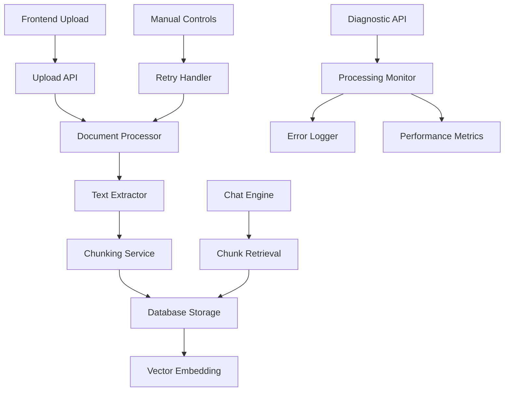

# Design Document

## Overview

This design document outlines a comprehensive debugging and monitoring system for PDF upload and chunking issues in the RAG Educational Chatbot. The system will provide detailed diagnostics, error handling, and manual controls to ensure reliable document processing.

## Architecture

The debugging system follows a layered architecture with enhanced monitoring and error handling:



## Components and Interfaces

### 1. Enhanced Document Processor

**Purpose**: Process PDF uploads with comprehensive error handling and status tracking.

**Key Methods**:
- `process_document_with_diagnostics(content, filename, metadata)` - Main processing with full diagnostics
- `validate_pdf_content(content)` - Pre-processing validation
- `extract_text_with_retry(content, max_retries=3)` - Text extraction with retry logic
- `get_processing_status(document_id)` - Status tracking

**Error Handling**:
- Catch and categorize PyMuPDF exceptions
- Validate PDF structure before processing
- Implement exponential backoff for retries
- Log detailed error context

### 2. Diagnostic Service

**Purpose**: Provide comprehensive monitoring and debugging capabilities.

**Key Methods**:
- `get_document_diagnostics(document_id)` - Full diagnostic report
- `validate_processing_pipeline()` - End-to-end pipeline health check
- `get_performance_metrics()` - Processing performance data
- `run_system_diagnostics()` - Complete system health check

**Diagnostic Data**:
- Processing timestamps and durations
- Error logs with stack traces
- Memory usage during processing
- Chunk statistics and quality metrics

### 3. Processing Status Manager

**Purpose**: Track and manage document processing states.

**Status States**:
- `PENDING` - Document uploaded, awaiting processing
- `EXTRACTING` - Text extraction in progress
- `CHUNKING` - Text chunking in progress
- `EMBEDDING` - Vector embedding in progress
- `COMPLETED` - All processing completed successfully
- `ERROR` - Processing failed with error details
- `RETRYING` - Manual retry in progress

**Key Methods**:
- `update_status(document_id, status, details)` - Update processing status
- `get_status_history(document_id)` - Processing history
- `mark_for_retry(document_id, retry_config)` - Queue for manual retry

### 4. Enhanced Chunking Service

**Purpose**: Improved chunking with better error handling and diagnostics.

**Key Enhancements**:
- Pre-chunking text validation
- Chunk quality assessment
- Configurable retry strategies
- Performance monitoring

**Key Methods**:
- `chunk_with_diagnostics(text, strategy, params)` - Chunking with full diagnostics
- `validate_chunk_quality(chunks)` - Assess chunk quality
- `get_chunking_metrics(document_id)` - Chunking performance data

### 5. Manual Processing Controls

**Purpose**: Allow teachers to manually control and retry document processing.

**Key Features**:
- Retry with different chunking strategies
- Adjust chunking parameters
- View processing logs
- Force reprocessing

**API Endpoints**:
- `POST /api/documents/{id}/retry` - Retry processing
- `GET /api/documents/{id}/diagnostics` - Get diagnostic info
- `PUT /api/documents/{id}/chunking-config` - Update chunking config

## Data Models

### ProcessingStatus Model

```python
class ProcessingStatus(BaseModel):
    document_id: int
    status: ProcessingStatusEnum
    started_at: datetime
    completed_at: Optional[datetime]
    error_message: Optional[str]
    error_details: Optional[dict]
    processing_duration: Optional[float]
    retry_count: int = 0
```

### DiagnosticReport Model

```python
class DiagnosticReport(BaseModel):
    document_id: int
    file_info: FileInfo
    extraction_info: ExtractionInfo
    chunking_info: ChunkingInfo
    error_log: List[ErrorEntry]
    performance_metrics: PerformanceMetrics
    recommendations: List[str]
```

### ChunkQualityMetrics Model

```python
class ChunkQualityMetrics(BaseModel):
    total_chunks: int
    avg_chunk_size: int
    size_distribution: dict
    overlap_analysis: dict
    content_quality_score: float
    recommendations: List[str]
```

## Error Handling

### Error Categories

1. **File Format Errors**
   - Invalid PDF structure
   - Corrupted file content
   - Unsupported PDF features

2. **Text Extraction Errors**
   - PyMuPDF library errors
   - Memory allocation failures
   - Encoding issues

3. **Chunking Errors**
   - Invalid text input
   - Strategy configuration errors
   - Resource exhaustion

4. **Database Errors**
   - Connection failures
   - Transaction rollbacks
   - Constraint violations

### Error Recovery Strategies

1. **Automatic Retry**: For transient errors (network, memory)
2. **Alternative Strategies**: Try different chunking approaches
3. **Graceful Degradation**: Partial processing when possible
4. **User Notification**: Clear error messages with suggested actions

## Testing Strategy

### Unit Tests

- Document processor error handling
- Chunking service edge cases
- Status manager state transitions
- Diagnostic service accuracy

### Integration Tests

- End-to-end PDF processing pipeline
- Error propagation and handling
- Manual retry workflows
- Chat integration with processed documents

## Correctness Properties

*A property is a characteristic or behavior that should hold true across all valid executions of a system-essentially, a formal statement about what the system should do. Properties serve as the bridge between human-readable specifications and machine-verifiable correctness guarantees.*

### Property Reflection

After reviewing all testable properties from the prework analysis, I identified several areas where properties can be consolidated:

- Properties 4.1-4.5 (status transitions) can be combined into comprehensive status management properties
- Properties 3.1-3.5 (error logging) can be consolidated into error handling properties  
- Properties 1.1-1.5 (PDF processing) can be grouped into document processing properties
- Properties 6.1-6.5 (chat integration) can be combined into integration properties

### Core Properties

**Property 1: PDF Processing Pipeline Integrity**
*For any* valid PDF file, the complete processing pipeline (upload → extract → chunk → store) should either succeed entirely or fail with detailed error information, never leaving the system in an inconsistent state.
**Validates: Requirements 1.1, 1.3, 2.1, 2.3**

**Property 2: Error Handling Completeness**
*For any* processing failure at any stage, the system should log detailed error information, set appropriate error status, and provide user-friendly feedback.
**Validates: Requirements 1.2, 2.4, 3.1, 3.2, 3.3, 4.5**

**Property 3: Status Transition Consistency**
*For any* document processing workflow, status transitions should follow the correct sequence (pending → extracting → chunking → completed/error) and never skip states or transition invalidly.
**Validates: Requirements 4.1, 4.2, 4.3, 4.4, 4.5**

**Property 4: Chunking Configuration Adherence**
*For any* chunking operation, the system should use the configured chunking strategy and parameters, and produce chunks that match the expected characteristics for those settings.
**Validates: Requirements 2.2, 2.5, 5.3**

**Property 5: Retry Operation Consistency**
*For any* failed document that is manually retried, the retry operation should use current configuration settings and either succeed with updated status or fail with new error details.
**Validates: Requirements 5.2, 5.3, 5.5**

**Property 6: Chat Integration Completeness**
*For any* successfully chunked document, the chat engine should be able to search and retrieve relevant chunks, and responses should include proper source attribution.
**Validates: Requirements 6.1, 6.2, 6.4, 6.5**

**Property 7: Performance Monitoring Accuracy**
*For any* document processing operation, the system should accurately track and log performance metrics including processing time, memory usage, and success/failure rates.
**Validates: Requirements 7.1, 7.2, 7.3, 7.4, 7.5**

**Property 8: Input Validation Robustness**
*For any* file upload, the system should properly validate file size, format, and content, rejecting invalid inputs with appropriate error messages.
**Validates: Requirements 1.2, 1.4**

**Property 9: Data Consistency Maintenance**
*For any* document processing operation, database transactions should maintain consistency, with proper rollback on failures and accurate chunk indexing on success.
**Validates: Requirements 2.3, 3.5**

### Testing Strategy

**Dual Testing Approach**:
- **Unit tests**: Verify specific error conditions, edge cases, and individual component behavior
- **Property tests**: Verify universal properties across all processing scenarios
- Both are complementary and necessary for comprehensive coverage

**Property-Based Testing Configuration**:
- Use Hypothesis for Python property-based testing
- Minimum 100 iterations per property test
- Each property test must reference its design document property
- Tag format: **Feature: pdf-debugging, Property {number}: {property_text}**

**Unit Testing Focus**:
- Specific PDF corruption scenarios
- Individual chunking strategy edge cases
- Database transaction rollback scenarios
- UI retry button functionality
- Specific error message validation

**Property Testing Focus**:
- Universal processing pipeline behavior
- Error handling across all failure modes
- Status transition correctness for all workflows
- Configuration adherence across all strategies
- Performance monitoring accuracy for all operations
