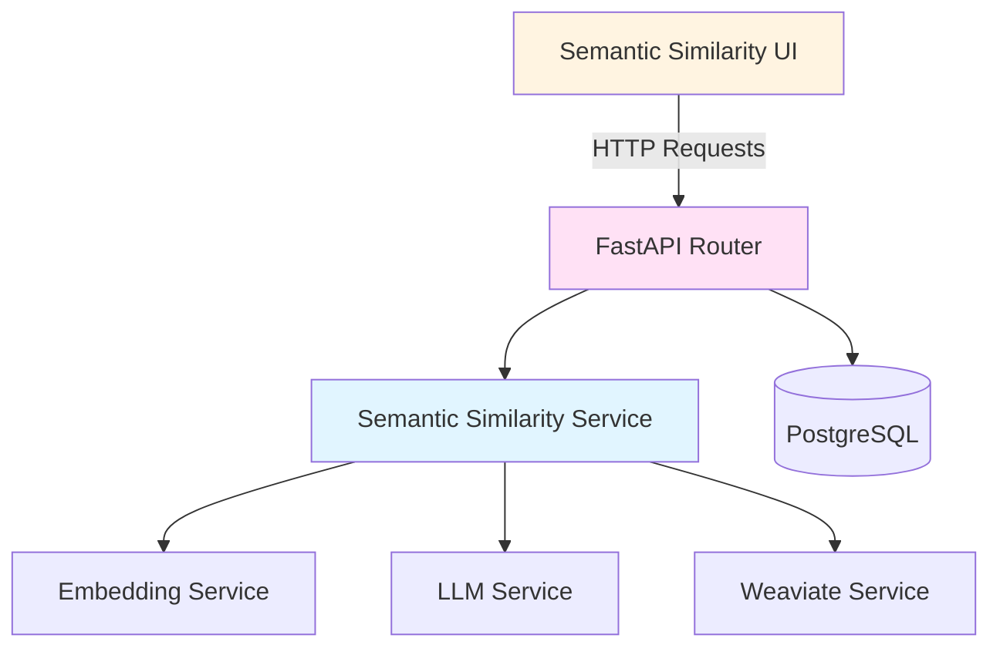

# Design Document: Semantic Similarity Test

## Overview

The Semantic Similarity Test feature extends the RAG evaluation system by providing a direct, quantitative measure of how semantically similar generated answers are to ground truth answers. Unlike RAGAS metrics which evaluate multiple aspects of RAG quality (faithfulness, relevancy, etc.), semantic similarity focuses specifically on measuring the closeness of meaning between two text passages using embedding vectors and cosine similarity.

This feature will be implemented as a new page in the dashboard, accessible from the sidebar under the RAGAS section. It will follow the same architectural patterns as the existing RAGAS evaluation system, reusing services for embeddings, LLM, and database access.

## Architecture

The system follows a three-tier architecture:

1. **Frontend (Next.js/React)**: User interface for test configuration, execution, and results display
2. **Backend API (FastAPI)**: REST endpoints for test execution and result management
3. **Services Layer**: Reusable services for embeddings, similarity calculation, and data persistence

### Component Diagram



## Components and Interfaces

### 1. Frontend Components

#### SemanticSimilarityPage Component
- **Location**: `frontend/src/app/dashboard/semantic-similarity/page.tsx`
- **Purpose**: Main page component that orchestrates the semantic similarity testing interface
- **State Management**:
  - Course selection
  - Quick test inputs and results
  - Batch test inputs and results
  - Saved results with pagination and filtering
  - Loading states for async operations

#### QuickTestCard Component
- **Purpose**: Expandable card for single-question testing
- **Inputs**:
  - Question (required)
  - Ground truth (required)
  - Alternative ground truths (optional, dynamic list)
  - Generated answer (optional - if empty, will be generated)
- **Outputs**:
  - Similarity score with color-coded display
  - Generated answer (if applicable)
  - Execution latency
  - Save result button

#### BatchTestCard Component
- **Purpose**: Expandable card for multi-question testing via JSON
- **Inputs**:
  - JSON textarea with format:
    ```json
    [
      {
        "question": "string",
        "ground_truth": "string",
        "alternative_ground_truths": ["string"],
        "generated_answer": "string (optional)"
      }
    ]
    ```
- **Outputs**:
  - Results table with columns: question, ground truth, generated answer, similarity score, latency
  - Aggregate statistics: avg/min/max similarity, total latency
  - Export results button

#### SavedResultsCard Component
- **Purpose**: Expandable card for viewing and managing saved results
- **Features**:
  - Group filter dropdown
  - Pagination controls
  - Result detail view
  - Delete result action

### 2. Backend API Endpoints

#### POST /api/semantic-similarity/quick-test
- **Purpose**: Execute a single semantic similarity test
- **Request Body**:
  ```typescript
  {
    course_id: number
    question: string
    ground_truth: string
    alternative_ground_truths?: string[]
    generated_answer?: string  // If omitted, will be generated
  }
  ```
- **Response**:
  ```typescript
  {
    question: string
    ground_truth: string
    generated_answer: string
    similarity_score: number  // 0.0 to 1.0
    best_match_ground_truth: string  // Which ground truth had highest similarity
    all_scores: { ground_truth: string, score: number }[]
    latency_ms: number
    embedding_model_used: string
    llm_model_used?: string  // Only if answer was generated
  }
  ```

#### POST /api/semantic-similarity/batch-test
- **Purpose**: Execute multiple semantic similarity tests
- **Request Body**:
  ```typescript
  {
    course_id: number
    test_cases: Array<{
      question: string
      ground_truth: string
      alternative_ground_truths?: string[]
      generated_answer?: string
    }>
  }
  ```
- **Response**:
  ```typescript
  {
    results: Array<{
      question: string
      ground_truth: string
      generated_answer: string
      similarity_score: number
      best_match_ground_truth: string
      latency_ms: number
    }>
    aggregate: {
      avg_similarity: number
      min_similarity: number
      max_similarity: number
      total_latency_ms: number
      test_count: number
    }
    embedding_model_used: string
    llm_model_used?: string
  }
  ```

#### POST /api/semantic-similarity/results
- **Purpose**: Save a test result for later viewing
- **Request Body**: Similar to quick-test response plus optional group_name
- **Response**: Saved result with ID and timestamp

#### GET /api/semantic-similarity/results
- **Purpose**: List saved results with filtering and pagination
- **Query Parameters**: course_id, group_name (optional), skip, limit
- **Response**: Paginated list of results with total count and available groups

#### GET /api/semantic-similarity/results/{result_id}
- **Purpose**: Get a single saved result
- **Response**: Full result details

#### DELETE /api/semantic-similarity/results/{result_id}
- **Purpose**: Delete a saved result
- **Response**: 204 No Content

### 3. Backend Services

#### SemanticSimilarityService
- **Location**: `backend/app/services/semantic_similarity_service.py`
- **Purpose**: Core business logic for semantic similarity testing
- **Key Methods**:
  - `compute_similarity(text1: str, text2: str, embedding_model: str) -> float`
    - Gets embeddings for both texts
    - Computes cosine similarity
    - Returns score between 0.0 and 1.0
  
  - `find_best_match(generated: str, ground_truths: List[str], embedding_model: str) -> Tuple[float, str, List[Dict]]`
    - Computes similarity against all ground truths
    - Returns max score, best matching ground truth, and all scores
  
  - `generate_answer(course_id: int, question: str, db: Session) -> Tuple[str, List[str]]`
    - Uses RAG pipeline to generate answer
    - Returns generated answer and retrieved contexts
    - Reuses existing LLMService and WeaviateService

#### Cosine Similarity Calculation
```python
import numpy as np

def cosine_similarity(vec1: List[float], vec2: List[float]) -> float:
    """
    Compute cosine similarity between two vectors.
    Returns value between -1 and 1, where 1 means identical direction.
    """
    v1 = np.array(vec1)
    v2 = np.array(vec2)
    
    dot_product = np.dot(v1, v2)
    norm_v1 = np.linalg.norm(v1)
    norm_v2 = np.linalg.norm(v2)
    
    if norm_v1 == 0 or norm_v2 == 0:
        return 0.0
    
    return float(dot_product / (norm_v1 * norm_v2))
```

## Data Models

### Database Model: SemanticSimilarityResult

```python
class SemanticSimilarityResult(Base):
    __tablename__ = "semantic_similarity_results"
    
    id = Column(Integer, primary_key=True, index=True)
    course_id = Column(Integer, ForeignKey("courses.id"), nullable=False)
    group_name = Column(String, nullable=True, index=True)
    
    # Test inputs
    question = Column(Text, nullable=False)
    ground_truth = Column(Text, nullable=False)
    alternative_ground_truths = Column(JSON, nullable=True)
    generated_answer = Column(Text, nullable=False)
    
    # Test results
    similarity_score = Column(Float, nullable=False)
    best_match_ground_truth = Column(Text, nullable=False)
    all_scores = Column(JSON, nullable=True)  # List of {ground_truth, score}
    
    # Metadata
    latency_ms = Column(Integer, nullable=False)
    embedding_model_used = Column(String, nullable=False)
    llm_model_used = Column(String, nullable=True)
    
    # Audit fields
    created_by = Column(Integer, ForeignKey("users.id"), nullable=False)
    created_at = Column(DateTime, default=datetime.utcnow, nullable=False)
    
    # Relationships
    course = relationship("Course", back_populates="semantic_similarity_results")
    creator = relationship("User")
```

### Pydantic Schemas

```python
class SemanticSimilarityQuickTestRequest(BaseModel):
    course_id: int
    question: str
    ground_truth: str
    alternative_ground_truths: Optional[List[str]] = None
    generated_answer: Optional[str] = None

class SemanticSimilarityQuickTestResponse(BaseModel):
    question: str
    ground_truth: str
    generated_answer: str
    similarity_score: float
    best_match_ground_truth: str
    all_scores: List[Dict[str, Any]]
    latency_ms: int
    embedding_model_used: str
    llm_model_used: Optional[str] = None

class SemanticSimilarityBatchTestRequest(BaseModel):
    course_id: int
    test_cases: List[SemanticSimilarityQuickTestRequest]

class SemanticSimilarityBatchTestResponse(BaseModel):
    results: List[SemanticSimilarityQuickTestResponse]
    aggregate: Dict[str, Any]
    embedding_model_used: str
    llm_model_used: Optional[str] = None

class SemanticSimilarityResultCreate(BaseModel):
    course_id: int
    group_name: Optional[str] = None
    question: str
    ground_truth: str
    alternative_ground_truths: Optional[List[str]] = None
    generated_answer: str
    similarity_score: float
    best_match_ground_truth: str
    all_scores: Optional[List[Dict[str, Any]]] = None
    latency_ms: int
    embedding_model_used: str
    llm_model_used: Optional[str] = None

class SemanticSimilarityResultResponse(BaseModel):
    id: int
    course_id: int
    group_name: Optional[str]
    question: str
    ground_truth: str
    alternative_ground_truths: Optional[List[str]]
    generated_answer: str
    similarity_score: float
    best_match_ground_truth: str
    all_scores: Optional[List[Dict[str, Any]]]
    latency_ms: int
    embedding_model_used: str
    llm_model_used: Optional[str]
    created_by: int
    created_at: datetime

class SemanticSimilarityResultListResponse(BaseModel):
    results: List[SemanticSimilarityResultResponse]
    total: int
    groups: List[str]
```

## Correctness Properties


*A property is a characteristic or behavior that should hold true across all valid executions of a system—essentially, a formal statement about what the system should do. Properties serve as the bridge between human-readable specifications and machine-verifiable correctness guarantees.*

### Acceptance Criteria Testing Prework

1.1 WHEN a ground truth and generated answer are provided, THE Semantic_Similarity_Test SHALL compute embedding vectors for both texts using the Session_Embedding_Model
Thoughts: This is about the core computation that should work for any pair of texts. We can generate random text pairs and verify that embeddings are computed and similarity is calculated.
Testable: yes - property

1.2 WHEN multiple alternative ground truths are provided, THE Semantic_Similarity_Test SHALL compute similarity scores for each alternative
Thoughts: This is a rule that should apply to any set of alternatives. We can generate random sets of ground truths and verify each gets a similarity score.
Testable: yes - property

1.3 WHEN multiple similarity scores exist, THE Semantic_Similarity_Test SHALL return the maximum similarity score as the final result
Thoughts: This is a metamorphic property - for any set of scores, the max should be returned. We can test with various score sets.
Testable: yes - property

1.4 THE Semantic_Similarity_Test SHALL compute cosine similarity between embedding vectors
Thoughts: This is about the specific algorithm used. We can verify the mathematical properties of cosine similarity.
Testable: yes - property

1.5 THE Semantic_Similarity_Test SHALL return similarity scores as percentages between 0% and 100%
Thoughts: This is an invariant - all outputs must be in this range. We can test with random inputs.
Testable: yes - property

2.1 WHEN the quick test interface is displayed, THE System SHALL provide input fields for question, ground truth, and generated answer
Thoughts: This is about UI rendering, which is not easily testable as a property.
Testable: no

2.2 WHEN alternative ground truths are needed, THE System SHALL allow adding multiple alternative ground truth inputs
Thoughts: This is about UI functionality for dynamic lists, not a computational property.
Testable: no

2.3 WHEN the user provides a question without a generated answer, THE System SHALL use the Session_LLM to generate an answer using the RAG pipeline
Thoughts: This is about conditional behavior - if no answer provided, generate one. We can test this with various inputs.
Testable: yes - property

2.4 WHEN the user provides a pre-generated answer, THE System SHALL skip answer generation and directly compute similarity
Thoughts: This is the inverse of 2.3 - if answer provided, don't generate. We can test this behavior.
Testable: yes - property

2.5 WHEN the test completes, THE System SHALL display the similarity score with visual indicators
Thoughts: This is about UI display, not a computational property.
Testable: no

2.6 WHEN the test completes, THE System SHALL display execution latency in milliseconds
Thoughts: This is about UI display of timing data, not a computational property.
Testable: no

3.1 WHEN the batch test interface is displayed, THE System SHALL provide a JSON input field for multiple test cases
Thoughts: This is about UI rendering.
Testable: no

3.2 THE System SHALL accept JSON format with array of objects containing: question, ground_truth, alternative_ground_truths, generated_answer
Thoughts: This is about JSON parsing and validation. We can test with various JSON inputs.
Testable: yes - property

3.3 WHEN generated_answer is omitted from a test case, THE System SHALL generate answers using the Session_LLM and RAG pipeline
Thoughts: Similar to 2.3, this is conditional behavior we can test.
Testable: yes - property

3.4 WHEN batch test is executed, THE System SHALL process all test cases sequentially
Thoughts: This is about execution order and completeness. We can verify all cases are processed.
Testable: yes - property

3.5 WHEN batch test completes, THE System SHALL display results in a table
Thoughts: This is about UI rendering.
Testable: no

3.6 WHEN batch test completes, THE System SHALL display aggregate statistics
Thoughts: This is about UI rendering, but the aggregate calculation itself is testable.
Testable: yes - property (for calculation, not display)

4.1 WHEN a quick test completes, THE System SHALL provide an option to save the result
Thoughts: This is about UI functionality.
Testable: no

4.2 WHEN saving a result, THE System SHALL allow specifying an optional group name
Thoughts: This is about UI input handling.
Testable: no

4.3 WHEN a result is saved, THE System SHALL store all required fields
Thoughts: This is about data persistence. We can verify all fields are stored correctly.
Testable: yes - property

4.4 THE System SHALL provide a saved results view
Thoughts: This is about UI rendering.
Testable: no

4.5 WHEN viewing saved results, THE System SHALL allow filtering by group name
Thoughts: This is about query filtering. We can test that filtering returns correct results.
Testable: yes - property

4.6 WHEN viewing saved results, THE System SHALL support pagination
Thoughts: This is about query pagination. We can test that pagination returns correct subsets.
Testable: yes - property

4.7 WHEN viewing a saved result, THE System SHALL display all stored information
Thoughts: This is about UI rendering.
Testable: no

5.1-5.6: All UI integration requirements
Thoughts: These are all about UI structure and navigation, not computational properties.
Testable: no

6.1 WHEN generating answers, THE System SHALL use the Session_LLM configured in course settings
Thoughts: This is about configuration usage. We can verify the correct model is used.
Testable: yes - example

6.2 WHEN computing embeddings, THE System SHALL use the Session_Embedding_Model configured in course settings
Thoughts: This is about configuration usage. We can verify the correct model is used.
Testable: yes - example

6.3 WHEN using the system prompt, THE System SHALL use the prompt configured in course settings
Thoughts: This is about configuration usage.
Testable: yes - example

6.4 THE System SHALL allow viewing which models are being used
Thoughts: This is about UI display.
Testable: no

6.5 WHEN course settings are updated, THE System SHALL reflect the changes in subsequent tests
Thoughts: This is about state management and configuration updates.
Testable: yes - property

7.1 WHEN required fields are missing, THE System SHALL display validation errors
Thoughts: This is about input validation. We can test with various invalid inputs.
Testable: yes - property

7.2 WHEN the embedding service fails, THE System SHALL display an error message
Thoughts: This is about error handling. We can test error scenarios.
Testable: yes - example

7.3 WHEN the LLM service fails, THE System SHALL display an error message
Thoughts: This is about error handling.
Testable: yes - example

7.4 WHEN JSON input is malformed, THE System SHALL display a parsing error
Thoughts: This is about error handling for invalid JSON.
Testable: yes - property

7.5 WHEN a test case fails in batch test, THE System SHALL continue processing remaining cases
Thoughts: This is about error resilience. We can test that one failure doesn't stop the batch.
Testable: yes - property

8.1-8.5: Performance display requirements
Thoughts: These are about UI display of timing data, not computational properties.
Testable: no


### Property Reflection

After reviewing the prework, I identify the following potential redundancies:
- Properties 1.1, 1.2, and 1.4 all relate to embedding computation and similarity calculation - these can be combined into a comprehensive property about the core similarity computation
- Properties 2.3 and 3.3 are essentially the same (conditional answer generation) - combine into one
- Properties 2.4 can be tested as part of the answer generation property (inverse case)
- Properties 4.5 and 4.6 are both about query operations - can be tested together

### Correctness Properties

**Property 1: Cosine Similarity Bounds**
*For any* two text passages, the computed cosine similarity score SHALL be between 0.0 and 1.0 (inclusive), and SHALL be displayed as a percentage between 0% and 100%
**Validates: Requirements 1.4, 1.5**

**Property 2: Maximum Similarity Selection**
*For any* generated answer and set of ground truth alternatives, the final similarity score SHALL equal the maximum similarity score among all ground truth comparisons
**Validates: Requirements 1.2, 1.3**

**Property 3: Embedding Computation Consistency**
*For any* identical text pair provided multiple times, the computed similarity score SHALL be identical across all computations (deterministic)
**Validates: Requirements 1.1, 1.4**

**Property 4: Conditional Answer Generation**
*For any* test request, if generated_answer is null or empty, the system SHALL generate an answer using the RAG pipeline; if generated_answer is provided, the system SHALL use it directly without generation
**Validates: Requirements 2.3, 2.4, 3.3**

**Property 5: JSON Batch Parsing**
*For any* valid JSON array of test cases, the system SHALL successfully parse all test cases and extract question, ground_truth, alternative_ground_truths, and generated_answer fields
**Validates: Requirements 3.2**

**Property 6: Batch Processing Completeness**
*For any* batch of N test cases, the system SHALL process all N cases and return N results, regardless of individual test case failures
**Validates: Requirements 3.4, 7.5**

**Property 7: Aggregate Statistics Accuracy**
*For any* batch test results, the computed aggregate statistics (avg, min, max similarity) SHALL accurately reflect the individual test case scores
**Validates: Requirements 3.6**

**Property 8: Result Persistence Round-Trip**
*For any* test result that is saved, retrieving it by ID SHALL return all stored fields with values identical to those saved
**Validates: Requirements 4.3**

**Property 9: Group Filtering Correctness**
*For any* group name filter, the returned results SHALL only include results with that exact group name, and pagination SHALL return non-overlapping subsets
**Validates: Requirements 4.5, 4.6**

**Property 10: Configuration Usage**
*For any* test execution, the system SHALL use the embedding model and LLM model specified in the course settings at the time of execution
**Validates: Requirements 6.1, 6.2, 6.3**

**Property 11: Input Validation**
*For any* test request with missing required fields (course_id, question, or ground_truth), the system SHALL reject the request with a validation error before processing
**Validates: Requirements 7.1**

**Property 12: Malformed JSON Handling**
*For any* batch test request with invalid JSON syntax, the system SHALL return a parsing error without attempting to process test cases
**Validates: Requirements 7.4**


## Error Handling

The system implements comprehensive error handling at multiple layers:

### API Layer Error Handling

1. **Input Validation Errors** (400 Bad Request)
   - Missing required fields (course_id, question, ground_truth)
   - Invalid data types
   - Malformed JSON in batch requests
   - Empty or whitespace-only text fields

2. **Authorization Errors** (401/403)
   - User not authenticated
   - User lacks access to specified course
   - Non-teacher attempting restricted operations

3. **Resource Not Found Errors** (404)
   - Course ID does not exist
   - Result ID does not exist
   - Embedding model not configured

4. **Service Errors** (500/503)
   - Embedding service unavailable
   - LLM service unavailable
   - Database connection errors
   - Weaviate service unavailable

### Service Layer Error Handling

1. **Embedding Service Failures**
   - Retry logic with exponential backoff (up to 3 attempts)
   - Fallback to default embedding model if configured model fails
   - Clear error messages indicating which model failed

2. **LLM Service Failures**
   - Timeout handling (30 second default)
   - Rate limit detection and appropriate error messages
   - API key validation errors

3. **Batch Processing Resilience**
   - Individual test case failures do not stop batch processing
   - Failed cases marked with error messages in results
   - Aggregate statistics computed only from successful cases

### Frontend Error Handling

1. **User-Friendly Error Messages**
   - Technical errors translated to actionable messages
   - Validation errors displayed inline on form fields
   - Toast notifications for async operation failures

2. **Loading States**
   - Disable submit buttons during processing
   - Show progress indicators for long-running operations
   - Prevent duplicate submissions

3. **Graceful Degradation**
   - Display partial results if some batch cases fail
   - Allow retry of failed operations
   - Preserve user input on errors

## Testing Strategy

The testing strategy employs both unit tests and property-based tests to ensure comprehensive coverage.

### Unit Testing

Unit tests focus on specific examples, edge cases, and integration points:

1. **API Endpoint Tests**
   - Test each endpoint with valid inputs
   - Test authentication and authorization
   - Test error responses for invalid inputs
   - Test pagination boundary conditions

2. **Service Layer Tests**
   - Test cosine similarity calculation with known vectors
   - Test embedding service integration
   - Test LLM service integration
   - Test database operations (CRUD)

3. **Frontend Component Tests**
   - Test form validation
   - Test user interactions (button clicks, input changes)
   - Test conditional rendering
   - Test error state display

4. **Edge Cases**
   - Empty strings
   - Very long texts (>10,000 characters)
   - Special characters and Unicode
   - Zero-length embedding vectors
   - Identical ground truth and generated answer

### Property-Based Testing

Property tests verify universal properties across randomized inputs. Each property test runs a minimum of 100 iterations.

1. **Similarity Computation Properties**
   - Property 1: Cosine Similarity Bounds
     - Generate random text pairs
     - Verify scores always in [0.0, 1.0] range
     - Tag: `Feature: semantic-similarity-test, Property 1: Cosine Similarity Bounds`

   - Property 2: Maximum Similarity Selection
     - Generate random answer and multiple ground truths
     - Verify returned score equals max of all comparisons
     - Tag: `Feature: semantic-similarity-test, Property 2: Maximum Similarity Selection`

   - Property 3: Embedding Computation Consistency
     - Generate random text pair, compute similarity multiple times
     - Verify all results identical
     - Tag: `Feature: semantic-similarity-test, Property 3: Embedding Computation Consistency`

2. **Request Processing Properties**
   - Property 4: Conditional Answer Generation
     - Generate requests with and without generated_answer
     - Verify generation only occurs when needed
     - Tag: `Feature: semantic-similarity-test, Property 4: Conditional Answer Generation`

   - Property 5: JSON Batch Parsing
     - Generate random valid JSON test case arrays
     - Verify all fields correctly extracted
     - Tag: `Feature: semantic-similarity-test, Property 5: JSON Batch Parsing`

   - Property 6: Batch Processing Completeness
     - Generate batches of varying sizes
     - Inject random failures
     - Verify all cases processed
     - Tag: `Feature: semantic-similarity-test, Property 6: Batch Processing Completeness`

3. **Data Persistence Properties**
   - Property 8: Result Persistence Round-Trip
     - Generate random test results
     - Save and retrieve
     - Verify all fields match
     - Tag: `Feature: semantic-similarity-test, Property 8: Result Persistence Round-Trip`

   - Property 9: Group Filtering Correctness
     - Generate results with various group names
     - Test filtering and pagination
     - Verify correct subsets returned
     - Tag: `Feature: semantic-similarity-test, Property 9: Group Filtering Correctness`

4. **Validation Properties**
   - Property 11: Input Validation
     - Generate requests with missing required fields
     - Verify all rejected with validation errors
     - Tag: `Feature: semantic-similarity-test, Property 11: Input Validation`

   - Property 12: Malformed JSON Handling
     - Generate invalid JSON strings
     - Verify parsing errors returned
     - Tag: `Feature: semantic-similarity-test, Property 12: Malformed JSON Handling`

### Testing Framework

- **Backend**: pytest with pytest-asyncio for async tests
- **Property Testing**: Hypothesis library for Python
- **Frontend**: Jest and React Testing Library
- **Integration Tests**: End-to-end tests using Playwright
- **Test Database**: SQLite in-memory database for fast test execution

### Test Data Generation

For property-based tests, use Hypothesis strategies:

```python
from hypothesis import given, strategies as st

@given(
    text1=st.text(min_size=1, max_size=1000),
    text2=st.text(min_size=1, max_size=1000)
)
def test_similarity_bounds(text1, text2):
    """Property 1: Cosine Similarity Bounds"""
    score = compute_similarity(text1, text2, embedding_model="default")
    assert 0.0 <= score <= 1.0
```

### Continuous Integration

- All tests run on every pull request
- Property tests run with 100 iterations in CI
- Coverage target: 80% for backend, 70% for frontend
- Performance benchmarks tracked for similarity computation

