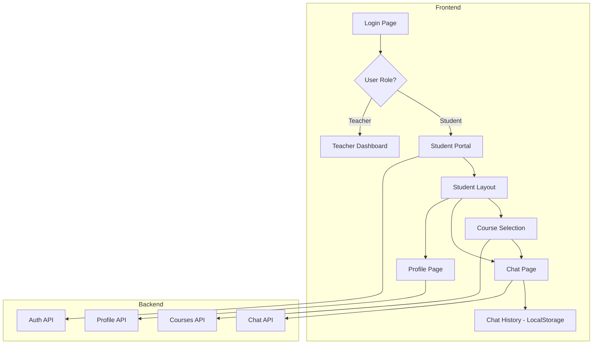

# Design Document: Student Portal

## Overview

Öğrenci portalı, mevcut dashboard yapısını kullanarak öğrencilere özel basitleştirilmiş bir arayüz sunacaktır. Sistem, kullanıcı rolüne göre (student/teacher) farklı navigasyon ve özellikler gösterecektir. Öğrenciler sadece ders seçimi, chat ve profil sayfalarına erişebilecektir.

## Architecture



## Components and Interfaces

### 1. Student Layout Component

Öğrenci portalı için özel layout bileşeni. Mevcut dashboard layout'undan türetilecek ancak sadece öğrenci özelliklerini gösterecek.

```typescript
// frontend/src/app/student/layout.tsx
interface StudentLayoutProps {
  children: React.ReactNode;
}

// Sidebar navigation items for students
const studentNavItems = [
  { href: "/student", icon: BookOpen, label: "Dersler", exact: true },
  { href: "/student/profile", icon: User, label: "Profil" },
];
```

### 2. Course Selection Component

Öğrencilerin mevcut dersleri görüntüleyip seçebileceği sayfa.

```typescript
// frontend/src/app/student/page.tsx
interface CourseCardProps {
  course: Course;
  onSelect: (courseId: number) => void;
}

// Course card displays: name, description, document count
// Click navigates to /student/chat/[courseId]
```

### 3. Student Chat Page

Seçilen ders için tam ekran chat arayüzü.

```typescript
// frontend/src/app/student/chat/[courseId]/page.tsx
interface StudentChatPageProps {
  params: { courseId: string };
}

// Features:
// - Full-screen chat interface
// - Back button to course selection
// - Course name in header
// - Chat history persistence
// - Source references display
```

### 4. Chat History Service

LocalStorage tabanlı sohbet geçmişi yönetimi.

```typescript
// frontend/src/lib/chat-history.ts
interface ChatHistoryService {
  getHistory(courseId: number): Message[];
  saveHistory(courseId: number, messages: Message[]): void;
  clearHistory(courseId: number): void;
  getAllCourseIds(): number[];
}

const STORAGE_KEY_PREFIX = "student_chat_history_";
```

### 5. Profile Page Component

Öğrenci profil bilgilerini görüntüleme ve düzenleme.

```typescript
// frontend/src/app/student/profile/page.tsx
interface ProfileFormData {
  full_name: string;
  email: string;
}

interface PasswordChangeData {
  current_password: string;
  new_password: string;
  confirm_password: string;
}
```

## Data Models

### Existing Models (No Changes Required)

```typescript
// User model - already supports student role
interface User {
  id: number;
  email: string;
  full_name: string;
  role: "teacher" | "student";
  created_at: string;
}

// Course model - students can view all active courses
interface Course {
  id: number;
  name: string;
  description: string | null;
  teacher_id: number;
  created_at: string;
}

// Chat models - reused from existing implementation
interface ChatMessage {
  role: "user" | "assistant";
  content: string;
}

interface ChatResponse {
  message: string;
  sources: ChunkReference[];
}
```

### New/Extended Models

```typescript
// Extended message for history storage
interface StoredMessage extends ChatMessage {
  timestamp: string;
  responseTime?: number;
  sources?: ChunkReference[];
}

// Chat history storage format
interface CourseHistory {
  courseId: number;
  courseName: string;
  messages: StoredMessage[];
  lastUpdated: string;
}
```

## Correctness Properties

*A property is a characteristic or behavior that should hold true across all valid executions of a system-essentially, a formal statement about what the system should do. Properties serve as the bridge between human-readable specifications and machine-verifiable correctness guarantees.*

### Property 1: Role-based Navigation Filtering
*For any* student user, the navigation sidebar SHALL only display student-allowed pages (Dersler, Profil) and SHALL NOT display admin pages (Chunking, RAGAS, Settings).
**Validates: Requirements 1.1, 1.2**

### Property 2: Chat History Persistence Round-trip
*For any* valid chat message sent in a course, saving to localStorage and then retrieving SHALL return an equivalent message with the same content, role, and timestamp.
**Validates: Requirements 4.1, 4.2**

### Property 3: Course-specific History Isolation
*For any* two different courses, chat history stored for one course SHALL NOT affect or be visible in the chat history of the other course.
**Validates: Requirements 4.3**

### Property 4: Chat History Clear Operation
*For any* course with existing chat history, after clearing the history, retrieving the history SHALL return an empty array.
**Validates: Requirements 4.4**

### Property 5: Course Display Completeness
*For any* list of courses, the Course_Selector SHALL render all courses with their name and description visible.
**Validates: Requirements 2.1, 2.3**

### Property 6: Source References Display
*For any* chat response containing source references, the Chat_Interface SHALL render all source references with document name and relevance score.
**Validates: Requirements 3.3**

### Property 7: Navigation Consistency
*For any* page in the student portal, the sidebar navigation SHALL be present and the current page SHALL be highlighted.
**Validates: Requirements 6.1, 6.3**

## Error Handling

### Frontend Error Handling

| Error Type | Handling Strategy |
|------------|-------------------|
| API Connection Error | Display toast notification, allow retry |
| Chat API Error | Show error message in chat, preserve user input |
| Profile Update Error | Display specific error message, keep form data |
| LocalStorage Full | Warn user, offer to clear old history |
| Invalid Course Access | Redirect to course selection with error message |

### Error Messages (Turkish)

```typescript
const errorMessages = {
  connectionError: "Bağlantı hatası. Lütfen tekrar deneyin.",
  chatError: "Mesaj gönderilemedi. Lütfen tekrar deneyin.",
  profileUpdateError: "Profil güncellenemedi.",
  passwordChangeError: "Şifre değiştirilemedi.",
  courseNotFound: "Ders bulunamadı.",
  unauthorized: "Bu işlem için yetkiniz yok.",
};
```

## Testing Strategy

### Unit Tests
- Navigation filtering based on user role
- Chat history localStorage operations
- Profile form validation
- Course card rendering

### Property-Based Tests
- Chat history round-trip property (Property 2)
- Course history isolation property (Property 3)

### Integration Tests
- Student login flow and redirect
- Course selection to chat navigation
- Profile update API integration
- Chat message send/receive flow

### Test Configuration
- Use Vitest for unit and property tests
- Use fast-check for property-based testing
- Minimum 100 iterations per property test
